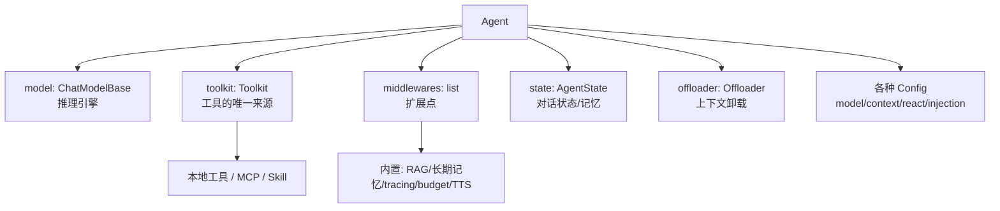

# AgentScope 2.0 源码学习指南（详细版）

> 面向想从零读懂 AgentScope 源码的开发者。AgentScope 2.0 是阿里通义实验室出品的**生产级多 Agent 框架**，定位类似 LangGraph / AutoGen，但更强调"为越来越强的 agentic LLM 设计"。
>
> 本指南按"先全局后局部、先核心抽象后服务部署"的顺序编排，每块给出**目录位置 + 代码解释 + 一个真实例子 + 动手验证点**。所有代码片段均来自真实源码。

---

## 📑 目录（点击跳转）

- [一、写在前面](#一写在前面)
- [二、项目是什么 & 技术栈速览](#二项目是什么--技术栈速览)
  - [2.1 一句话定位](#21-一句话定位)
  - [2.2 六大核心特性](#22-六大核心特性)
  - [2.3 技术栈全景](#23-技术栈全景)
- [三、顶层目录与代码地图](#三顶层目录与代码地图)
  - [3.1 顶层目录](#31-顶层目录)
  - [3.2 核心 src/agentscope/ 子模块速览](#32-核心-srcagentscope-子模块速览)
- [四、第一步：安装 & 跑通 Hello Agent](#四第一步安装--跑通-hello-agent)
  - [4.1 安装](#41-安装)
  - [4.2 第一个 Agent（库模式）](#42-第一个-agent库模式)
- [五、推荐学习路线总图](#五推荐学习路线总图)
- [六、核心抽象全景：Agent 由什么组成](#六核心抽象全景agent-由什么组成)
- [七、Agent 类（框架的心脏）](#七agent-类框架的心脏)
  - [7.1 构造参数详解](#71-构造参数详解)
  - [7.2 ReAct 循环与 reply 流](#72-react-循环与-reply-流)
  - [7.3 四种 Config](#73-四种-config)
- [八、Message & Block（消息的积木）](#八message--block消息的积木)
- [九、Model（模型抽象层）](#九model模型抽象层)
  - [9.1 统一抽象 ChatModelBase](#91-统一抽象-chatmodelbase)
  - [9.2 Credential（凭证分离）](#92-credential凭证分离)
- [十、Tool & Toolkit（工具系统）](#十tool--toolkit工具系统)
  - [10.1 三种"工具"来源](#101-三种工具来源)
  - [10.2 Toolkit 是工具的唯一来源](#102-toolkit-是工具的唯一来源)
  - [10.3 怎么写一个自定义工具](#103-怎么写一个自定义工具)
- [十一、Event System（事件流，前端的命脉）](#十一event-system事件流前端的命脉)
  - [11.1 一切皆事件](#111-一切皆事件)
  - [11.2 事件类型速查](#112-事件类型速查)
  - [11.3 怎么消费事件流](#113-怎么消费事件流)
- [十二、Middleware System（扩展的灵魂，重点）](#十二middleware-system扩展的灵魂重点)
  - [12.1 7 个 hook 点](#121-7-个-hook-点)
  - [12.2 洋葱模式 vs 变换器模式](#122-洋葱模式-vs-变换器模式)
  - [12.3 一个真实中间件例子](#123-一个真实中间件例子)
  - [12.4 内置中间件](#124-内置中间件)
- [十三、Permission System（权限系统）](#十三permission-system权限系统)
- [十四、Workspace / Sandbox（工具执行的沙箱）](#十四workspace--sandbox工具执行的沙箱)
- [十五、State & 长期记忆](#十五state--长期记忆)
- [十六、Skill & MCP](#十六skill--mcp)
- [十七、Agent Service（生产级服务，app/）](#十七agent-service生产级服务app)
  - [17.1 多租户 & 多会话](#171-多租户--多会话)
  - [17.2 app/ 目录结构](#172-app-目录结构)
  - [17.3 跑通 Agent Service](#173-跑通-agent-service)
- [十八、动手实操 & 练手目标](#十八动手实操--练手目标)
- [十九、调试技巧 & 避坑](#十九调试技巧--避坑)
- [二十、学习时间规划](#二十学习时间规划)
- [附 A：关键文件速查表](#附-a关键文件速查表)
- [附 B：名词表](#附-b名词表)

---

## 一、写在前面

AgentScope 2.0 是一次**彻底重写**（与 v1 无共用代码）。它的设计哲学很关键：

> **为越来越 agentic 的 LLM 设计**——利用模型自身的推理和工具使用能力，而不是用死板的 prompt 和强编排去约束它。

理解了这句话，就理解了为什么它的核心抽象是 `Agent + Toolkit + Middleware + Event`，而不是"工作流节点"。本指南帮你按正确顺序吃透这些抽象。

---

## 二、项目是什么 & 技术栈速览

### 2.1 一句话定位

AgentScope 2.0 是阿里通义（Tongyi Lab）出品的**生产级、易用的多 Agent 框架**，提供 Agent 的核心抽象 + 多租户/多会话服务部署能力。

### 2.2 六大核心特性

| 特性 | 说明 |
|------|------|
| **Event System** | 统一事件总线，支持前端集成和人机交互（Human-in-the-loop） |
| **Permission System** | 对工具/资源的细粒度、可配置权限控制 |
| **Multi-tenancy & Multi-session** | 生产级服务，租户/会话隔离 |
| **Workspace / Sandbox** | 隔离环境运行工具和代码（支持 Local/Docker/E2B/OpenSandbox/Daytona） |
| **Extensible Middleware** | 可组合的钩子，定制 Agent 的推理-行动循环 |
| **Long-term Memory / RAG** | 支持 ReMe / Mem0 / Agentic Memory 等 |

### 2.3 技术栈全景

| 层 | 技术 |
|----|------|
| 语言 | **Python 3.11+**（大量使用 async/await、`match/case`） |
| 异步 | asyncio（全异步设计，`reply_stream` 返回 AsyncGenerator） |
| 模型 SDK | openai / anthropic / dashscope（通义）/ gemini / ollama / xai |
| 服务 | **FastAPI** + uvicorn + ag-ui-protocol（可选 extra `service`） |
| 存储 | 可选 extra：`storage-redis` / `storage-sql`（SQLAlchemy 2.0 async + Alembic）/ `storage-s3` |
| 沙箱 | 可选 extra：`workspace-docker` / `workspace-e2b` 等 |
| 可观测 | **OpenTelemetry**（内置 tracing） |
| MCP | 内置 `mcp<2.0.0` 协议支持 |

---

## 三、顶层目录与代码地图

### 3.1 顶层目录

```
agentscope/
├── src/
│   └── agentscope/            # ★★★ 核心库（学习重心）
├── examples/                  # ★ 大量可跑示例（agent_service/web_ui/rag/long_term_memory...）
├── tests/                     # 测试（学 API 用法的好地方）
├── docs/                      # 文档源（docs.agentscope.io）
├── scripts/                   # 工具脚本
├── pyproject.toml             # 依赖与 optional extras（关键！见下）
└── README.md
```

> **重点**：`pyproject.toml` 用 optional extras 管理可选依赖（`models` / `service` / `storage-*` / `workspace-*`），按需安装。

### 3.2 核心 src/agentscope/ 子模块速览

| 目录 | 职责 | 学习优先级 |
|------|------|-----------|
| `agent/` | **Agent 类**（框架心脏）、Config | ★★★★★ |
| `model/` | 模型抽象层（ChatModelBase + 各 provider） | ★★★★ |
| `message/` | 消息 Msg + 各种 Block（Text/Thinking/ToolCall/ToolResult/Data） | ★★★★ |
| `tool/` | **Toolkit + 工具基类** + 内置工具（Bash/Grep/Read/Write/Edit…） | ★★★★ |
| `event/` | **事件系统**（AgentEvent + 各种子事件） | ★★★★ |
| `middleware/` | **中间件系统**（7 hook 点，扩展灵魂） | ★★★★★ |
| `permission/` | 权限引擎、规则、决策 | ★★★ |
| `workspace/` | 沙箱抽象 + 各 backend | ★★★ |
| `state/` | AgentState（对话状态/记忆） | ★★★ |
| `skill/` | 技能（提示词层面的能力封装） | ★★ |
| `mcp/` | MCP 协议集成 | ★★ |
| `rag/` | RAG 检索增强 | ★★ |
| `embedding/` | 向量嵌入 | ★★ |
| `tts/` | 语音合成 | ★ |
| `credential/` | 凭证（API Key 管理，与 model 分离） | ★★ |
| `formatter/` | 格式化 | ★ |
| `app/` | **Agent Service**（FastAPI 生产级服务） | ★★★★ |
| `exception/` | 异常定义 | ★ |
| `_utils/` `_logging.py` | 内部工具/日志 | ★ |

---

## 四、第一步：安装 & 跑通 Hello Agent

### 4.1 安装

```bash
# Python 3.11+ 必需
uv pip install agentscope
# 或 pip install agentscope

# 按需装 extra（服务、存储、沙箱、模型）
uv pip install "agentscope[service]"
uv pip install "agentscope[storage-redis,storage-sql]"
```

> 用通义模型需要 `DASHSCOPE_API_KEY` 环境变量。

### 4.2 第一个 Agent（库模式）

这是 README 的 Hello 示例，先跑通它，再逐行理解：

```python
from agentscope.agent import Agent
from agentscope.tool import Toolkit, Bash, Grep, Glob, Read, Write, Edit
from agentscope.credential import DashScopeCredential
from agentscope.model import DashScopeChatModel
from agentscope.message import UserMsg
from agentscope.event import EventType
import os, asyncio

async def main():
    agent = Agent(
        name="Friday",
        system_prompt="You're a helpful assistant named Friday.",
        model=DashScopeChatModel(
            credential=DashScopeCredential(api_key=os.environ["DASHSCOPE_API_KEY"]),
            model="qwen3.6-plus",
        ),
        toolkit=Toolkit(tools=[Bash(), Grep(), Glob(), Read(), Write(), Edit()]),
    )
    async for evt in agent.reply_stream(UserMsg("Tony", "Hi, Friday!")):
        match evt.type:                          # 用 match/case 处理事件流
            case EventType.REPLY_START: ...
            case EventType.MODEL_CALL_START: ...
            case EventType.TEXT_BLOCK_DELTA: ...
            case _: ...

asyncio.run(main())
```

> **动手验证**：先跑通这个，能看到事件流逐个产出，再带着这个体感去读 `agent/_agent.py`。

---

## 五、推荐学习路线总图

```
① 全景抽象（Agent 由什么组成）  →  ② 跑通 Hello Agent
        ↓
③ Message & Block  →  ④ Model & Credential  →  ⑤ Tool & Toolkit
        ↓
⑥ Event System（事件流）  →  ⑦ Agent 类 & ReAct 循环（核心）
        ↓
⑧ Middleware System（扩展灵魂，重点）  →  ⑨ Permission / Workspace / State
        ↓
⑩ Skill & MCP & RAG（进阶能力）  →  ⑪ Agent Service（生产级部署）
```

> **核心心法**：AgentScope 的所有复杂特性（权限、记忆、RAG、tracing）**都是通过 Middleware 接入 Agent 的**。吃透 Middleware，就掌握了扩展一切的方法。

---

## 六、核心抽象全景：Agent 由什么组成

一个 `Agent` 把这些抽象组合在一起：



**调用入口**只有两个：`agent.reply(...)`（同步聚合）和 `agent.reply_stream(...)`（异步事件流，**前端用它**）。

---

## 七、Agent 类（框架的心脏）

📂 `src/agentscope/agent/_agent.py`

### 7.1 构造参数详解

真实签名（精简）：

```python
class Agent:
    def __init__(
        self,
        name: str,                       # Agent 标识
        system_prompt: str,              # 系统提示词（运行时可被中间件动态追加）
        model: ChatModelBase,            # 推理用的聊天模型
        toolkit: Toolkit | None = None,  # ★ 工具/MCP/Skill 的唯一来源
        middlewares: list[MiddlewareBase] | None = None,  # ★ 扩展点
        state: AgentState | None = None, # 对话状态/记忆（不传则新建）
        offloader: Offloader | None = None,  # 上下文/工具结果卸载
        model_config: ModelConfig | None = None,        # 模型配置（fallback/retries）
        context_config: ContextConfig | None = None,    # 上下文/工具结果压缩
        react_config: ReActConfig | None = None,        # 推理-行动循环配置
        injection_config: InjectionConfig | None = None,# 运行时状态注入
    ):
```

**关键设计**：
- `toolkit` 是工具的**唯一来源**——本地工具、MCP、Skill 都注册进 Toolkit
- `middlewares` 是扩展一切行为的统一入口（权限、记忆、RAG、tracing 都靠它）
- 大量 `*_config` 对象，把"配置"和"逻辑"分离

### 7.2 ReAct 循环与 reply 流

Agent 的核心是 **ReAct（Reasoning + Acting）循环**：

```
reply_stream(输入消息)
  → [reasoning] 调 model，拿到文本 + 可能的 ToolCall
  → 如果有 ToolCall → [acting] 执行工具，把结果塞回上下文
  → 再次 [reasoning] ... 循环
  → 直到模型不再调工具，产出最终回复
  → [compress context]（按配置压缩上下文）
```

整个过程的每个阶段都**发事件**（MODEL_CALL_START / TEXT_BLOCK_DELTA / TOOL_CALL_* / TOOL_RESULT_* / REPLY_END），所以前端能流式渲染。

> 读 `_agent.py` 时重点找 `_reasoning`、`_acting`、`reply`、`reply_stream` 这几个方法。

### 7.3 四种 Config

📂 `agent/_config.py`

| Config | 控制什么 |
|--------|---------|
| `ModelConfig` | 模型 fallback、重试 |
| `ContextConfig` | 上下文压缩、工具结果压缩 |
| `ReActConfig` | 推理-行动循环（最大轮次等） |
| `InjectionConfig` | 运行时状态注入 |

---

## 八、Message & Block（消息的积木）

📂 `src/agentscope/message/`

消息 `Msg` 是 Agent 间/Agent 与用户间传递的基本单位，内容由各种 **Block** 组成：

| Block | 含义 |
|-------|------|
| `TextBlock` | 文本 |
| `ThinkingBlock` | 思考过程（推理模型） |
| `ToolCallBlock` | 工具调用 |
| `ToolResultBlock` | 工具结果 |
| `DataBlock` | 结构化数据 |
| `HintBlock` | 提示块 |

便捷构造器：
```python
from agentscope.message import UserMsg, AssistantMsg, SystemMsg

agent.reply_stream(UserMsg("Tony", "帮我看看当前目录"))   # 用户消息
```

> 这种 Block 设计让一条消息能同时承载文本、思考、工具调用、工具结果，非常贴合现代 agentic LLM 的输出形态。

---

## 九、Model（模型抽象层）

📂 `src/agentscope/model/`

### 9.1 统一抽象 ChatModelBase

所有 provider（OpenAI / Anthropic / DashScope / Gemini / Ollama / xai）都实现 `ChatModelBase`，输出统一的 `ChatResponse`（含 `ChatUsage`、`FinishedReason`）。所以**换模型只改一个对象，不改 Agent 逻辑**。

```python
from agentscope.model import DashScopeChatModel
# 换成 OpenAI：from agentscope.model import OpenAIChatModel
```

### 9.2 Credential（凭证分离）

📂 `src/agentscope/credential/`

凭证（API Key）**和模型分离**，单独用 `Credential` 对象传入：

```python
from agentscope.credential import DashScopeCredential
model = DashScopeChatModel(
    credential=DashScopeCredential(api_key=os.environ["DASHSCOPE_API_KEY"]),
    model="qwen3.6-plus",
)
```

> 这种分离便于在服务端统一管理/轮转凭证。

---

## 十、Tool & Toolkit（工具系统）

📂 `src/agentscope/tool/`

```
tool/
├── _base.py          # ToolBase：工具基类
├── _toolkit.py       # ★ Toolkit：工具注册中心（唯一来源）
├── _builtin/         # 内置工具（Bash/Grep/Glob/Read/Write/Edit...）
├── _tool_group.py    # 工具分组
├── _task/            # 后台任务工具
├── _response.py      # ToolResponse / ToolChunk
└── _adapters.py      # 适配器
```

### 10.1 三种"工具"来源

1. **本地工具**：继承 `ToolBase`，或用内置的 `Bash`/`Read`/`Write`/`Edit`/`Grep`/`Glob`
2. **MCP 工具**：通过 `mcp/` 接入外部 MCP server 的工具
3. **Skill**：`skill/` 里的提示词层能力封装

### 10.2 Toolkit 是工具的唯一来源

所有工具都注册进一个 `Toolkit`，再传给 Agent。这让 Agent 对"自己有哪些工具"有清晰认知：

```python
from agentscope.tool import Toolkit, Bash, Read, Write

toolkit = Toolkit(tools=[Bash(), Read(), Write()])
agent = Agent(name="...", model=..., toolkit=toolkit)
```

### 10.3 怎么写一个自定义工具

继承 `ToolBase`，实现 `__call__`（框架会从 docstring/type hint 自动生成给 LLM 的工具描述）：

```python
from agentscope.tool import ToolBase, Toolkit

class WeatherTool(ToolBase):
    """查询某城市的天气。

    Args:
        city (str): 城市名
    """
    async def __call__(self, city: str) -> str:
        # 真实实现：调天气 API
        return f"{city} 今天晴，25°C"

toolkit = Toolkit(tools=[WeatherTool(), Bash()])
```

> **动手验证**：写个简单工具跑进 Hello Agent，让 Agent 调用它，观察 `TOOL_CALL_*` / `TOOL_RESULT_*` 事件流。

---

## 十一、Event System（事件流，前端的命脉）

📂 `src/agentscope/event/`（`_event.py` + `__init__.py`）

### 11.1 一切皆事件

Agent 的 `reply_stream` 是一个 **AsyncGenerator**，每一步都 `yield` 一个 `AgentEvent`。前端（Web UI）订阅这个事件流，就能流式渲染思考、文本、工具调用、工具结果。

### 11.2 事件类型速查

| 事件 | 含义 |
|------|------|
| `ReplyStartEvent` / `ReplyEndEvent` | 一次回复开始/结束 |
| `ModelCallStartEvent` / `ModelCallEndEvent` | 模型调用边界 |
| `TextBlockStart/Delta/EndEvent` | 文本块流式 token |
| `ThinkingBlock*Event` | 思考过程流式 |
| `ToolCallStart/Delta/EndEvent` | 工具调用流式 |
| `ToolResultStart/TextDelta/EndEvent` | 工具结果流式 |
| `RequireUserConfirmEvent` | 人机交互：请求用户确认 |
| `UserConfirmResultEvent` | 用户确认结果 |
| `RequireExternalExecutionEvent` | 请求外部执行 |
| `ExceedMaxItersEvent` | 超出最大轮次 |
| `UserInterruptEvent` | 用户打断 |

### 11.3 怎么消费事件流

```python
from agentscope.event import EventType

async for evt in agent.reply_stream(UserMsg(...)):
    match evt.type:
        case EventType.TEXT_BLOCK_DELTA:
            print(evt.delta, end="")      # 流式打印文本
        case EventType.TOOL_CALL_END:
            print(f"\n[调用工具 {evt.tool_name}]")
        case EventType.REPLY_END:
            print("\n[回复结束]")
```

> **关键**：Human-in-the-loop（人机交互）就是靠 `RequireUserConfirmEvent` 暂停 + `UserConfirmResultEvent` 恢复实现的。

---

## 十二、Middleware System（扩展的灵魂，重点）

📂 `src/agentscope/middleware/`

> **这是 AgentScope 2.0 最重要的设计**。权限、长期记忆、RAG、tracing、预算控制、TTS……**全部以中间件形式接入**。吃透它，你就能扩展一切。

### 12.1 7 个 hook 点

`MiddlewareBase`（`middleware/_base.py`）提供 7 个执行拦截点：

**洋葱模式（Onion，有 before/after）**：
- `on_reply`：拦截整个回复过程
- `on_reasoning`：拦截推理/模型调用阶段
- `on_check_permission`：拦截工具调用的权限检查
- `on_acting`：拦截单个工具执行
- `on_model_call`：拦截原始模型 API 调用
- `on_compress_context`：拦截上下文压缩

**变换器模式（Transformer，顺序管线）**：
- `on_system_prompt`：变换系统提示词字符串

### 12.2 洋葱模式 vs 变换器模式

- **洋葱模式**：中间件包在"目标方法"外面，可以 `yield` 透传事件流，在前后插入逻辑（就像装饰器 + 异步生成器）
- **变换器模式**：多个中间件串成流水线，依次变换输入（如改 system prompt）

每个 hook **可选实现**——只写你需要的，框架运行时自动检测哪些被实现（`is_implemented()`）。

### 12.3 一个真实中间件例子

```python
from agentscope.middleware import MiddlewareBase

class LoggingMiddleware(MiddlewareBase):
    async def on_reasoning(self, agent, input_kwargs, next_handler):
        print(f"Before reasoning for agent {agent.name}")
        async for event in next_handler():      # ★ 透传给下一层/原方法
            yield event
        print(f"After reasoning for agent {agent.name}")

agent = Agent(name="...", model=..., middlewares=[LoggingMiddleware()])
```

> 模式记牢：**打印/处理 → `async for ... in next_handler(): yield` → 打印/处理**。

### 12.4 内置中间件

📂 `middleware/` 下：

| 文件 | 中间件 | 作用 |
|------|--------|------|
| `_rag.py` | RAG 中间件 | 检索知识注入上下文 |
| `_longterm_memory/` | 长期记忆 | ReMe / Mem0 / Agentic Memory |
| `_budget.py` | 预算控制 | 限制 token/调用次数 |
| `_tracing/` | 链路追踪 | OpenTelemetry |
| `_tts_middleware.py` | TTS | 文本转语音 |

> **学习建议**：读 `_rag.py` 和 `_longterm_memory/`，它们是"如何用中间件实现复杂能力"的范本。

---

## 十三、Permission System（权限系统）

📂 `src/agentscope/permission/`

| 概念 | 含义 |
|------|------|
| `PermissionRule` | 规则（谁/什么工具/什么资源 → 决策） |
| `PermissionDecision` | 决策（allow/deny/...） |
| `PermissionBehavior` | 行为（命中规则后怎么办） |
| `PermissionEngine` | 引擎，把规则应用到工具调用 |

权限检查挂在中间件的 `on_check_permission` hook 上。配合事件 `RequireUserConfirmEvent`，实现"工具调用前请求用户确认"。

---

## 十四、Workspace / Sandbox（工具执行的沙箱）

📂 `src/agentscope/workspace/`

工具（尤其 `Bash`/`Write`）在隔离环境执行，支持多种 backend：

| Backend | extra |
|---------|-------|
| Local | 内置 |
| Docker | `workspace-docker` |
| E2B | `workspace-e2b` |
| OpenSandbox | （K8s） |
| Daytona | （最新支持） |

通过 `offloader` 把上下文/工具结果卸载到 workspace，控制 Agent 的内存占用。

---

## 十五、State & 长期记忆

📂 `src/agentscope/state/`

- `AgentState`：Agent 的对话状态（消息历史）
- `ReplyContext`：单次回复的上下文
- 长期记忆通过 **memory 中间件** 接入（ReMe / Mem0 / Agentic Memory），不写死在 Agent 里

> 配合 `examples/long_term_memory/` 里的三个示例（reme / mem0 / agentic_memory）学习。

---

## 十六、Skill & MCP

- **Skill**（`skill/`）：提示词层面的能力封装（区别于工具的工具）
- **MCP**（`mcp/`）：集成 Model Context Protocol，动态发现并接入远程工具/资源

两者最终都注册进 `Toolkit`，对 Agent 透明。

---

## 十七、Agent Service（生产级服务，app/）

📂 `src/agentscope/app/`

把上面的库变成一个**多租户、多会话、带 Web UI**的生产级服务。

### 17.1 多租户 & 多会话

- **多租户（Multi-tenancy）**：不同组织隔离
- **多会话（Multi-session）**：同一用户多个并发会话
- 内置 **Agent Team**（leader agent 派发 worker）、任务规划、权限控制、后台任务卸载

### 17.2 app/ 目录结构

```
app/
├── _app.py            # FastAPI 应用
├── _lifespan.py       # 生命周期
├── _router/           # 路由分组
├── _service/          # 业务服务层
├── _manager/          # 管理器（agent/会话/任务）
├── access/            # 访问控制（鉴权）
├── message_bus/       # ★ 消息总线（事件总线，前后端通信用）
├── middleware/        # 服务级中间件
├── rag/               # 分布式 RAG 服务
├── storage/           # 存储后端（redis/sql/s3）
├── workspace_manager/ # workspace 管理
├── _tool/ _types.py deps.py _bus_ops.py
└── __init__.py
```

> **关键**：`message_bus/` 是前后端通信枢纽——Web UI 通过它订阅 Agent 的事件流（SSE/WebSocket）。

### 17.3 跑通 Agent Service

```bash
cd agentscope/examples/agent_service
python main.py            # 启动后端服务

# 另开终端
cd agentscope/examples/web_ui
# 按 README 装 + 启动前端
```

---

## 十八、动手实操 & 练手目标

由易到难：

1. **跑通 Hello Agent**：拿到事件流，用 `match/case` 打印每类事件
2. **加一个自定义工具**：继承 `ToolBase`，注册进 Toolkit
3. **写一个中间件**：实现 `on_reasoning`，统计每次推理的 token 用量
4. **加 RAG 中间件**：用 `middleware/_rag.py` 给 Agent 注入知识
5. **跑通 Agent Service**：启动服务 + Web UI，体验 Agent Team / 任务规划 / 权限控制
6. **接一个 MCP 工具**：通过 `mcp/` 接入外部 MCP server

---

## 十九、调试技巧 & 避坑

- **全异步**：所有 Agent 调用走 `async/await`，测试用 `asyncio.run(main())`
- **读事件流**：调试 Agent 行为最快的方法是打印事件流（`async for evt`）
- **Python 版本**：必须 **3.11+**（用了 `match/case`、新 typing）
- **extra 没装**：用了 `Bash`/Docker 沙箱却没装 `workspace-docker`，会报 ImportError
- **凭证**：API Key 走 `Credential` 对象，别硬编码进 model
- **tracing**：内置 OpenTelemetry，配 `_tracing/` 中间件可接 Jaeger 等
- **tests/ 是宝藏**：学某个 API 怎么用，最快是看对应测试

---

## 二十、学习时间规划

| 阶段 | 内容 | 预计 |
|------|------|------|
| 第 1 周 | 全景抽象 + 跑通 Hello Agent + Message/Model/Tool | 10h |
| 第 2 周 | Agent 类 + ReAct 循环 + Event System | 12h |
| 第 3~4 周 | **Middleware System**（核心，重点）+ 内置中间件源码 | 20h |
| 第 5 周 | Permission / Workspace / State / 长期记忆 | 12h |
| 第 6 周 | Skill & MCP & RAG | 10h |
| 第 7 周+ | **Agent Service**（app/，生产部署）+ Web UI | 15h+ |

> **心法**：AgentScope 的精髓是"**用 Middleware 扩展一切**"。先把 Agent + Event + Middleware 三件套吃透，其余都是它们的组合。

---

## 附 A：关键文件速查表

| 想了解 | 看这里 |
|--------|--------|
| Agent 类 | `src/agentscope/agent/_agent.py` |
| Agent Config | `src/agentscope/agent/_config.py` |
| 消息 & Block | `src/agentscope/message/` |
| 模型抽象 | `src/agentscope/model/` |
| 凭证 | `src/agentscope/credential/` |
| 工具基类 | `src/agentscope/tool/_base.py` |
| Toolkit | `src/agentscope/tool/_toolkit.py` |
| 内置工具 | `src/agentscope/tool/_builtin/` |
| 事件 | `src/agentscope/event/_event.py` |
| **中间件基类（7 hook）** | `src/agentscope/middleware/_base.py` |
| 内置中间件 | `src/agentscope/middleware/`（_rag / _longterm_memory / _budget / _tracing） |
| 权限 | `src/agentscope/permission/` |
| 沙箱 | `src/agentscope/workspace/` |
| Agent Service | `src/agentscope/app/_app.py`、`app/message_bus/` |
| 可跑示例 | `examples/`（agent_service / web_ui / rag / long_term_memory） |
| 测试（学用法） | `tests/` |

## 附 B：名词表

| 名词 | 含义 |
|------|------|
| ReAct | Reasoning + Acting，Agent 边推理边调工具的循环 |
| Toolkit | 工具注册中心，Agent 的唯一工具来源 |
| Block | 消息的组成单元（Text/Thinking/ToolCall/ToolResult/Data） |
| Middleware | 中间件，通过 hook 点扩展 Agent 行为 |
| Onion 模式 | 中间件包在目标方法外，可透传事件流 |
| Transformer 模式 | 中间件串成流水线，依次变换输入 |
| Hook | 中间件的拦截点（共 7 个） |
| Event Bus | 事件总线，前后端/Agent 间通信枢纽 |
| MCP | Model Context Protocol，接入外部工具/资源的协议 |
| Skill | 提示词层面的能力封装 |
| Workspace | 工具/代码执行的隔离沙箱 |
| Multi-tenancy | 多租户隔离 |
| Agent Team | leader agent 派发 worker 协作的形态 |
| Human-in-the-loop | 人机交互（确认/打断） |
| ReMe / Mem0 / Agentic Memory | 三种长期记忆实现 |

---

祝学习顺利 🚀
